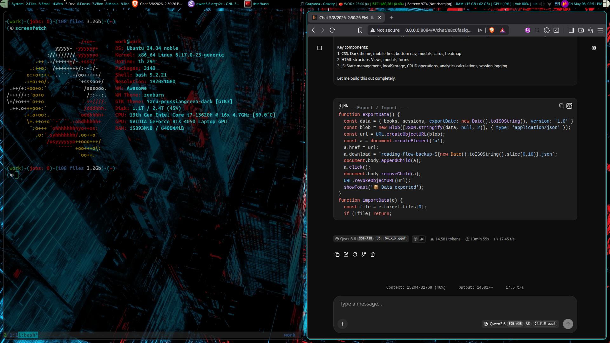
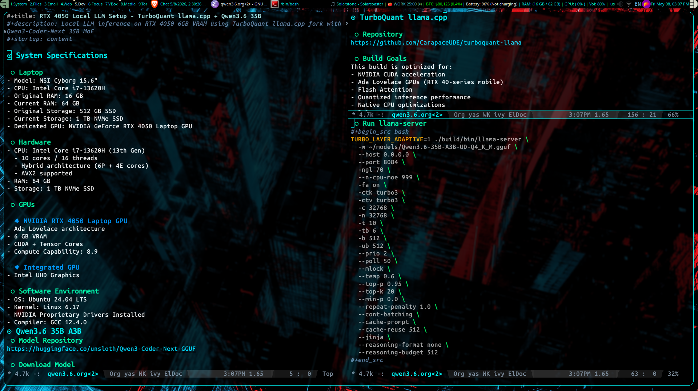
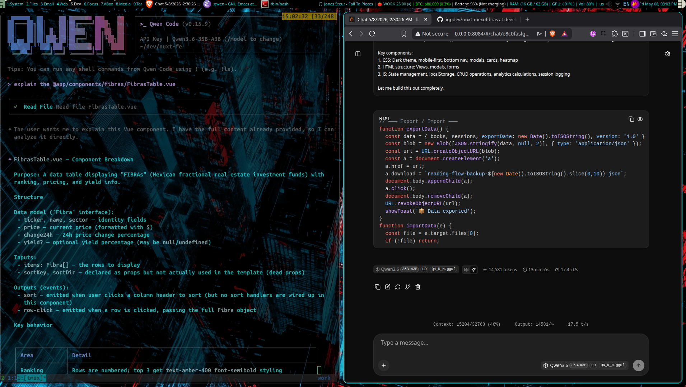
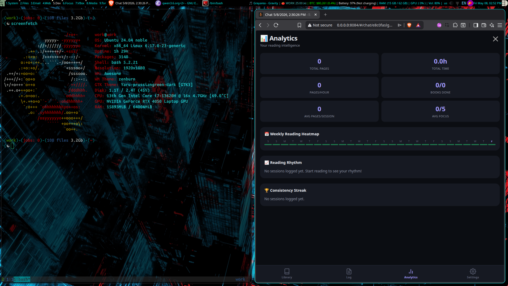

# RTX 4050 Local LLM Setup - TurboQuant llama.cpp + Qwen3.6 35B A3B

Local LLM inference on RTX 4050 6GB VRAM using TurboQuant llama.cpp with Qwen3.6 35B A3B GGUF

## Overview

| Model                        | Quant  | Context | GPU Offload | KV Cache | Expected Speed | Primary Use Case            |
|------------------------------|--------|---------|-------------|----------|----------------|-----------------------------|
| Qwen3.6 35B A3B              | Q4_K_M | 32k     | 70 layers   | turbo3   | ~17.45 t/s     | Long-context reasoning/chat |
| Qwen3-Coder 30B A3B Instruct | Q4_K_M | 64k     | auto        | q4_0     | ~25 t/s        | Coding and repository work  |

## System Specifications

### Laptop
- Model: MSI Cyborg 15.6"
- CPU: Intel Core i7-13620H
- Original RAM: 16 GB
- Current RAM: 64 GB
- Original Storage: 512 GB SSD
- Current Storage: 1 TB NVMe SSD
- Dedicated GPU: NVIDIA GeForce RTX 4050 Laptop GPU

### Hardware
- CPU: Intel Core i7-13620H (13th Gen)
  - 10 cores / 16 threads
  - Hybrid architecture (6P + 4E cores)
  - AVX2 supported
- RAM: 64 GB
- Storage: 1 TB NVMe SSD

### GPUs

#### NVIDIA RTX 4050 Laptop GPU
- Ada Lovelace architecture
- 6 GB VRAM
- CUDA + Tensor Cores
- Compute Capability: 8.9

#### Integrated GPU
- Intel UHD Graphics

### Software Environment
- OS: Ubuntu 24.04 LTS
- Kernel: Linux 6.17
- NVIDIA Proprietary Drivers Installed
- Compiler: GCC 12.4.0

## TurboQuant llama.cpp

### Repository
https://github.com/CarapaceUDE/turboquant-llama

### Build Goals
This build is optimized for:
- NVIDIA CUDA acceleration
- Ada Lovelace GPUs (RTX 40-series mobile)
- Flash Attention
- Quantized inference performance
- Native CPU optimizations
- Release-mode performance

### Active Backends
- ggml-cpu
- ggml-cuda

### Enabled Features
- GGML_CUDA=ON
- GGML_CUDA_FA=ON
- GGML_CUDA_FA_ALL_QUANTS=ON
- GGML_CUDA_GRAPHS=ON
- GGML_CUDA_NCCL=ON
- GGML_NATIVE=ON
- GGML_OPENMP=ON

### Disabled Backends
- Vulkan
- HIP / ROCm
- OpenCL
- Metal
- SYCL
- WebGPU

### Build Configuration
```bash
cmake -B build \
  -DCMAKE_BUILD_TYPE=Release \
  -DCMAKE_CUDA_ARCHITECTURES=89 \
  -DGGML_CUDA=ON \
  -DGGML_NATIVE=ON \
  -DGGML_CUDA_FA=ON \
  -DGGML_CUDA_FA_ALL_QUANTS=ON

cmake --build build -j$(nproc)
```

### Build Notes
- CUDA architecture 89 targets Ada Lovelace GPUs
- Flash Attention enabled for all supported quant types
- Native CPU optimizations enabled
- Release build optimized for inference performance

### Binary Verification
```bash
./build/bin/llama-cli --version
```

Expected output:
```
ggml_cuda_init: found 1 CUDA devices
Device 0: NVIDIA GeForce RTX 4050 Laptop GPU
compute capability 8.9
```

### Rebuild Script
```bash
cat > rebuild.sh <<'EOF'
rm -rf build

cmake -B build \
  -DCMAKE_BUILD_TYPE=Release \
  -DCMAKE_CUDA_ARCHITECTURES=89 \
  -DGGML_CUDA=ON \
  -DGGML_NATIVE=ON \
  -DGGML_CUDA_FA=ON \
  -DGGML_CUDA_FA_ALL_QUANTS=ON

cmake --build build -j$(nproc)
EOF

chmod +x rebuild.sh
```

## Qwen3.6 35B A3B

### Model Information
- Model: Qwen3.6 35B A3B
- Quantization: Q4_K_M GGUF
- Optimized for local inference with TurboQuant llama.cpp
- Suitable for long-context coding and general reasoning workloads

### Model File
```
~/models/Qwen3.6-35B-A3B-UD-Q4_K_M.gguf
```

### Runtime Configuration
Optimized for:
- RTX 4050 Laptop GPU (6 GB VRAM)
- TurboQuant KV cache
- CUDA Flash Attention
- Large context inference
- Continuous batching
- Long coding sessions

### Run llama-server
```bash
TURBO_LAYER_ADAPTIVE=1 ./build/bin/llama-server \
  -m ~/models/Qwen3.6-35B-A3B-UD-Q4_K_M.gguf \
  --host 0.0.0.0 \
  --port 8084 \
  -ngl 70 \
  --n-cpu-moe 999 \
  -fa on \
  -ctk turbo3 \
  -ctv turbo3 \
  -c 32768 \
  -n 32768 \
  -t 10 \
  -tb 6 \
  -b 512 \
  -ub 512 \
  --prio 2 \
  --poll 50 \
  --mlock \
  --temp 0.6 \
  --top-p 0.95 \
  --top-k 20 \
  --min-p 0.0 \
  --repeat-penalty 1.0 \
  --cont-batching \
  --cache-prompt \
  --cache-reuse 512 \
  --jinja \
  --reasoning-format none \
  --reasoning-budget 512
```

### Runtime Notes

#### Expected Performance
- Expect ~17.45 tokens/sec during generation
- Performance depends on:
  - Context size
  - Prompt complexity
  - GPU layer offloading
  - TurboQuant KV cache compression
  - Concurrent requests
- TurboQuant KV cache and Flash Attention improve throughput and memory efficiency on RTX 4050 6 GB GPUs
- Larger context sizes may reduce effective generation speed over time

#### GPU Offloading
`-ngl 70`
- Offloads 70 layers to GPU
- Optimized for RTX 4050 6 GB VRAM

#### TurboQuant KV Cache
`-ctk turbo3`
`-ctv turbo3`
- Enables TurboQuant KV cache compression

#### Adaptive Turbo Layers
`TURBO_LAYER_ADAPTIVE=1`
- Dynamically adapts TurboQuant layer behavior

#### Context Length
`-c 32768`
- 32k context window

#### CPU / Threading
`-t 10`
`-tb 6`
- Uses 10 CPU threads
- 6 batch threads

#### Continuous Batching
`--cont-batching`
- Better multi-request throughput
- Reduced latency during interactive usage

#### Prompt Cache
`--cache-prompt`
`--cache-reuse 512`
- Reuses prompt cache for repeated interactions

#### Memory Locking
`--mlock`
- Prevents model memory from being swapped to disk

#### Sampling Settings
- Temperature: 0.6
- Top-p: 0.95
- Top-k: 20
- Repeat penalty: 1.0

#### Reasoning Settings
`--reasoning-format none`
`--reasoning-budget 512`

### Access Server

#### Local Endpoint
```
http://localhost:8084
```

#### Network Endpoint
```
http://<your-ip>:8084
```

## Qwen3-Coder 30B A3B Instruct

### Model Information
- Model: Qwen3-Coder 30B A3B Instruct
- Quantization: Q4_K_M GGUF
- Optimized for local coding inference
- Supports large-context programming workflows
- Uses DeepSeek-style reasoning format

### Model File
```
/home/work/models/Qwen3-Coder-30B-A3B-Instruct-Q4_K_M.gguf
```

### Runtime Configuration
Optimized for:
- RTX 4050 Laptop GPU (6 GB VRAM)
- CUDA Flash Attention
- 64k context inference
- Continuous batching
- Long coding sessions
- Aggressive VRAM fitting

### Run llama-server
```bash
llama.cpp/build/bin/llama-server \
  -m /home/work/models/Qwen3-Coder-30B-A3B-Instruct-Q4_K_M.gguf \
  --host 0.0.0.0 \
  --port 8084 \
  -ngl auto \
  --fit on \
  -fa on \
  -ctk q4_0 \
  -ctv q4_0 \
  -c 65536 \
  -n 4096 \
  --no-context-shift \
  -t 6 \
  -tb 8 \
  -b 4096 \
  -ub 1024 \
  --prio 2 \
  --poll 50 \
  --mlock \
  --temp 0.6 \
  --top-p 0.95 \
  --top-k 20 \
  --min-p 0.0 \
  --repeat-penalty 1.0 \
  --cont-batching \
  --cache-prompt \
  --cache-reuse 256 \
  --jinja \
  --reasoning-format deepseek
```

### Runtime Notes

#### Expected Performance
- Expect ~25 tokens/sec during generation
- Performance depends on:
  - Context size
  - Prompt complexity
  - Active GPU offloading
  - KV cache usage
  - Concurrent requests
- Flash Attention and quantized KV cache significantly improve throughput on RTX 4050 6 GB GPUs

#### Automatic GPU Layer Offloading
`-ngl auto`
- Automatically determines optimal GPU offload
- Adapts to available VRAM capacity

#### VRAM Fit Mode
`--fit on`
- Attempts to fit the model into available GPU memory
- Reduces out-of-memory errors on 6 GB GPUs

#### Flash Attention
`-fa on`
- Enables CUDA Flash Attention
- Improves throughput and reduces memory usage

#### KV Cache Quantization
`-ctk q4_0`
`-ctv q4_0`
- Quantized KV cache for lower memory consumption

#### Context Length
`-c 65536`
- 64k context window
- Optimized for large repositories and long chats

#### Context Handling
`--no-context-shift`
- Prevents automatic context shifting
- Maintains stable long-context behavior

#### CPU / Threading
`-t 6`
`-tb 8`
- Uses 6 CPU inference threads
- Uses 8 batch-processing threads

#### Batch Configuration
`-b 4096`
`-ub 1024`
- Large batch sizes for improved throughput

#### Continuous Batching
`--cont-batching`
- Better multi-request concurrency
- Improved responsiveness during interactive use

#### Prompt Cache
`--cache-prompt`
`--cache-reuse 256`
- Reuses cached prompt states
- Reduces prompt processing overhead

#### Memory Locking
`--mlock`
- Prevents model memory from being swapped to disk

#### Sampling Settings
- Temperature: 0.6
- Top-p: 0.95
- Top-k: 20
- Repeat penalty: 1.0

#### Reasoning Settings
`--reasoning-format deepseek`
- Enables DeepSeek-compatible reasoning output formatting

### Access Server

#### Local Endpoint
```
http://localhost:8084
```

#### Network Endpoint
```
http://<your-ip>:8084
```

## Screenshots








