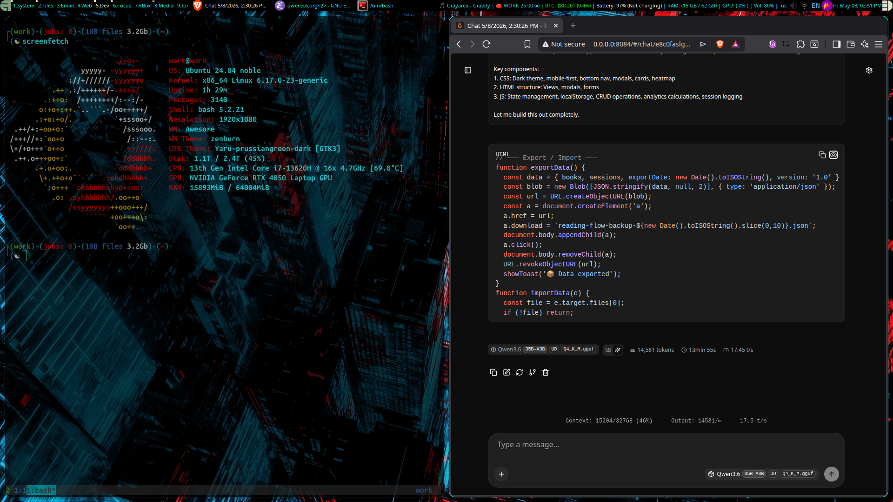
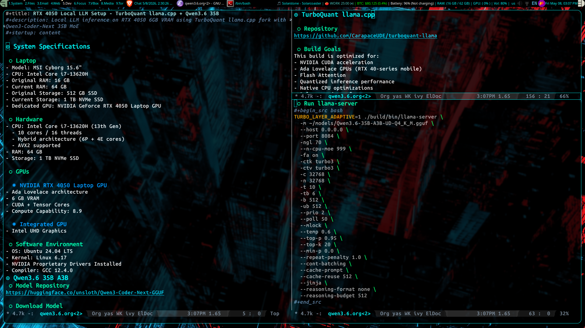
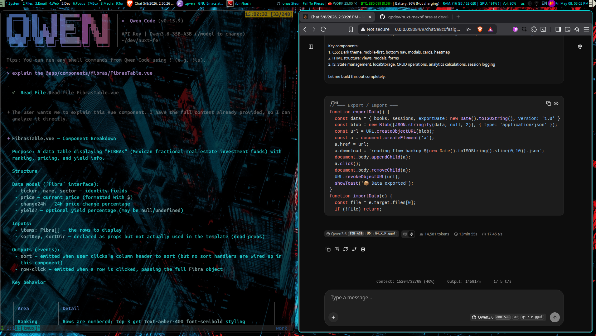
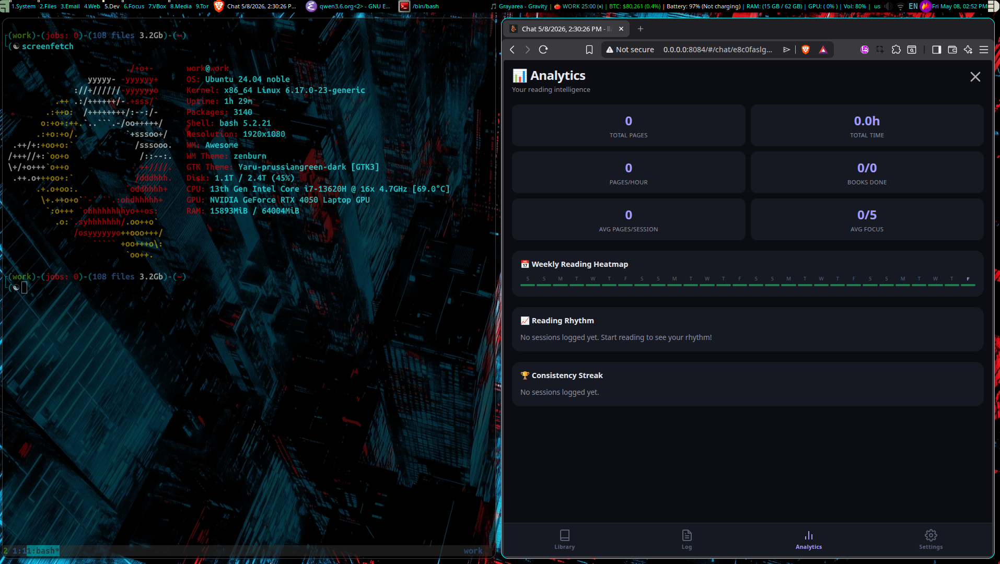

# RTX 4050 Local LLM Setup — llama.cpp + Qwen3.6 35B A3B

Local LLM inference on RTX 4050 6GB VRAM. Uses two different runtimes: **TurboQuant** (a custom llama.cpp fork) and the **official llama.cpp** upstream, which includes MTP support.

## Overview

| Model               | Quant   | Context | KV Cache | Expected Speed | llama.cpp Build    | Primary Use Case |
|---------------------|---------|---------|----------|----------------|--------------------|------------------|
| Qwen3.6 35B A3B     | Q4_K_M  | 65k     | q4_0     | ~17 t/s        | TurboQuant         | Agentic coding   |
| Qwen3.6 35B A3B     | IQ4_NL  | 160k    | q8_0     | ~23 t/s        | TurboQuant         | Agentic coding   |
| Qwen3.6 35B A3B MTP | Q4_K_XL | 100k    | q8_0     | ~30 t/s        | llama.cpp official | Agentic coding   |
| Qwen3.6 35B A3B MTP | Q4_K_XL | 100k    | q4_0     | ~30 t/s        | llama.cpp official | Agentic coding   |
---

## System Specifications

### Laptop
- **Model**: MSI Cyborg 15.6"
- **CPU**: Intel Core i7-13620H (13th Gen, 10 cores / 16 threads, 6P + 4E, AVX2)
- **RAM**: 64 GB (upgraded from 16 GB)
- **Storage**: 1 TB NVMe SSD (upgraded from 512 GB)
- **GPU**: NVIDIA GeForce RTX 4050 Laptop GPU
- **OS**: Ubuntu 24.04 LTS · Kernel 6.17 · NVIDIA Proprietary Drivers · GCC 12.4.0

### GPU Details

#### NVIDIA RTX 4050 Laptop GPU
- Ada Lovelace architecture
- 6 GB VRAM
- CUDA + Tensor Cores
- Compute Capability: 8.9

#### Integrated GPU
- Intel UHD Graphics

---

## llama.cpp Builds

| Runtime            | Used for       | Repo                                            |
|--------------------|----------------|-------------------------------------------------|
| TurboQuant         | Q4_K_M, IQ4_NL | https://github.com/CarapaceUDE/turboquant-llama |
| Official llama.cpp | MTP Q4_K_XL    | https://github.com/ggml-org/llama.cpp           |

See [`build-instructions.md`](./build-instructions.md) for full build steps, flags, and rebuild scripts.

---

## Models & Configs

### Qwen3.6 35B A3B — Q4_K_M
- [`qwen3.6-35-config-big-context.md`](./turbollama-configs/A3B-Q4_K_M/qwen3.6-35-config-big-context.md) — big context launch config
- [`qwen3.6-35-config-balanced.md`](./turbollama-configs/A3B-Q4_K_M/qwen3.6-35-config-balanced.md) — balanced launch config
- [`Qwen3.6-35B-A3B-UD-Q4_K_M-model-overview.md`](./turbollama-configs/A3B-Q4_K_M/Qwen3.6-35B-A3B-UD-Q4_K_M-model-overview.md) — model overview & download instructions

### Qwen3.6 35B A3B — IQ4_NL
- [`ultra-context-q8-23tps.md`](./turbollama-configs/A3B-IQ4_NL/ultra-context-q8-23tps.md) — ultra-long-context launch config (160K tokens, q8_0 KV)

### Qwen3.6 35B A3B MTP — Q4_K_XL
- [`high-context-q8-30tps.md`](./turbollama-configs/A3B-MTP-Q4_K_XL/high-context-q8-30tps.md) — MTP launch config & compilation instructions
- [`fast-prefill-q8-30tps.md`](./turbollama-configs/A3B-MTP-Q4_K_XL/fast-prefill-q8-30tps.md) — Config with option to get fast prefill (initial prompt)

### Qwen3.6 35B A3B MTP — Q4_K_XL (q4_0)
- [`high-context-q4-30tps.md`](./turbollama-configs/A3B-MTP-Q4_K_XL/high-context-q4-30tps.md) — MTP launch config & compilation instructions

---

## Screenshots

